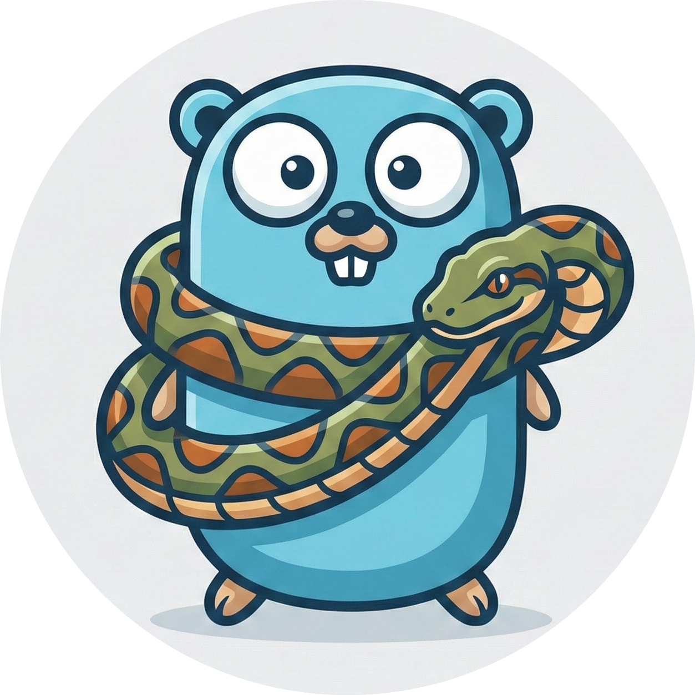

# snake

<p align="center">
  
</p>

一个轻量级的 Go 语言进程内 DAG（有向无环图）任务编排框架。

Snake 允许你定义具有显式依赖关系的任务，通过类型安全的方式共享数据，并并行执行这些任务。它采用“代码即配置”的方法，并提供了类似 Gin 的中间件系统，易于扩展。

## 特性

- **显式依赖管理**: 使用 Task ID 声明依赖。引擎会自动构建 DAG 并调度任务。
- **并行执行**: 独立的任务会并发运行。内置 Worker Pool 和事件驱动的调度器。
- **类型安全的数据共享**: 使用泛型 `Key[T]` 辅助函数在任务间传递数据，无需繁琐的类型断言。
- **中间件支持**: 支持全局或任务级中间件（日志、追踪、Panic 恢复等）。
- **统一上下文**: 每个任务都会获得一个统一的 Context，包含输入参数、存储访问、日志记录器和取消信号。
- **灵活的错误处理**: 支持 `FailFast`（默认）或 `RunAll` 策略。可通过 `AllowFailure` 支持非关键任务。

## 安装

```bash
go get github.com/don7panic/snake
```

## 快速开始

下面是一个完整的示例，展示了如何定义任务、安全地共享数据并执行工作流。

```go
package main

import (
	"context"
	"fmt"
	"time"

	"github.com/don7panic/snake"
)

// 1. 定义类型安全的键，用于数据共享
var (
	KeyUserID   = snake.NewKey[int]("user_id")
	KeyUserName = snake.NewKey[string]("user_name")
)

type UserInput struct {
	ID int
}

func main() {
	// 2. 初始化引擎 (Engine)
	engine := snake.NewEngine(
		snake.WithLogger(snake.NewDefaultLogger()),
		snake.WithMaxConcurrency(5),
	)

	// 3. 定义任务 (Task)
	
	// 任务 A: 获取用户数据
	taskFetch := snake.NewTask("fetch_user", func(c context.Context, ctx *snake.Context) error {
		input := ctx.Input().(*UserInput) // 获取执行输入
		
		// 模拟数据获取
		time.Sleep(100 * time.Millisecond)
		name := fmt.Sprintf("User-%d", input.ID)
		
		// 类型安全地保存结果
		snake.SetTyped(ctx, KeyUserName, name)
		
		ctx.Logger().Info(c, "fetched user", snake.Field{Key: "name", Value: name})
		return nil
	})

	// 任务 B: 处理用户数据 (依赖 A)
	taskProcess := snake.NewTask("process_user", func(c context.Context, ctx *snake.Context) error {
		// 类型安全地读取上游结果
		name, ok := snake.GetTyped(ctx, KeyUserName)
		if !ok {
			return fmt.Errorf("user name not found")
		}
		
		fmt.Printf("Processing user: %s\n", name)
		return nil
	}, snake.WithDependsOn(taskFetch)) // 声明依赖

	// 4. 注册任务
	if err := engine.Register(taskFetch, taskProcess); err != nil {
		panic(err)
	}

	// 5. 执行
	// 你可以使用不同的输入多次复用同一个引擎进行执行
	input := &UserInput{ID: 42}
	result, err := engine.Execute(context.Background(), input)
	
	if err != nil {
		fmt.Printf("Execution failed: %v\n", err)
	} else {
		fmt.Printf("Success! Order: %v\n", result.TopoOrder)
	}
}
```

## 核心概念

### Engine (引擎)
`Engine` 是核心协调者。它负责校验 DAG 并管理 Worker Pool。它是线程安全的，设计为“一次构建，多次执行”。

### Context (上下文)
每个任务执行时都会收到一个 `*snake.Context`。它封装了标准的 `context.Context` 并提供：
- **Input**: 访问传递给 `Execute` 的输入数据。
- **Store**: 读写本次执行范围内的 Datastore。
- **Logger**: 结构化日志记录器。
- **Next**: 控制中间件链的执行。

### 类型安全的数据共享
与其使用原始字符串 Key 和 `interface{}` 值，不如使用 `snake.Key[T]`：

```go
var KeyCount = snake.NewKey[int]("count")

// 写入
snake.SetTyped(ctx, KeyCount, 100)

// 读取
count, ok := snake.GetTyped(ctx, KeyCount) // count 是 int 类型
```

## 高级用法

### 中间件 (Middleware)
中间件允许你包装任务执行过程，添加通用逻辑。

```go
// 添加 Panic 恢复中间件
engine.Use(snake.Recovery())

// 自定义中间件
engine.Use(func(c context.Context, ctx *snake.Context) error {
    start := time.Now()
    defer func() {
        fmt.Printf("Task %s took %v\n", ctx.TaskID(), time.Since(start))
    }()
    return ctx.Next(c)
})
```

### 条件执行
在运行时动态跳过任务：

```go
task := snake.NewTask("optional_task", handler, 
    snake.WithCondition(func(c context.Context, ctx *snake.Context) bool {
        // 返回 false 以跳过此任务
        return shouldRun()
    }),
)
```

## License

MIT
